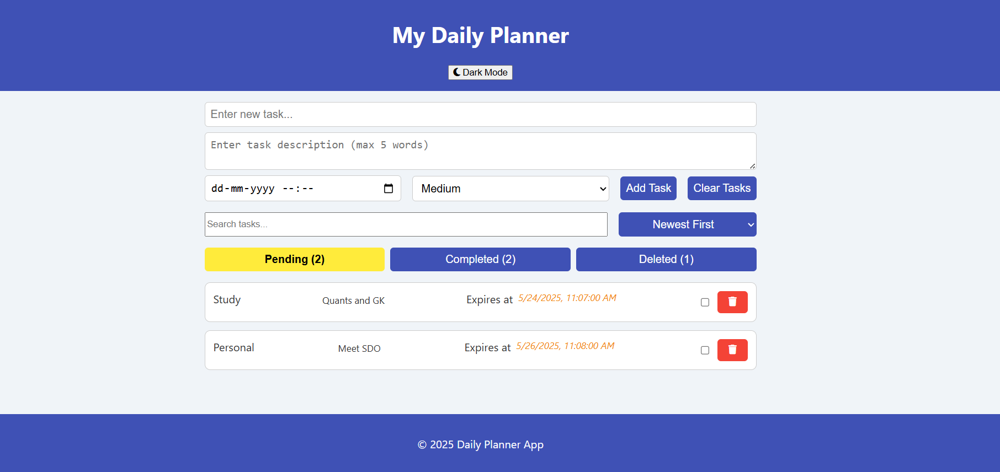
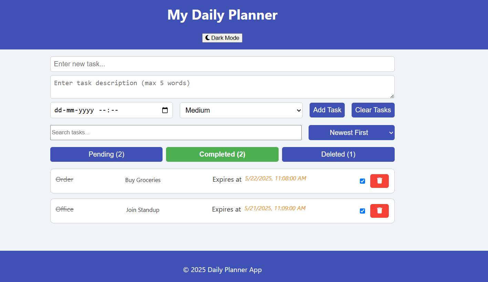
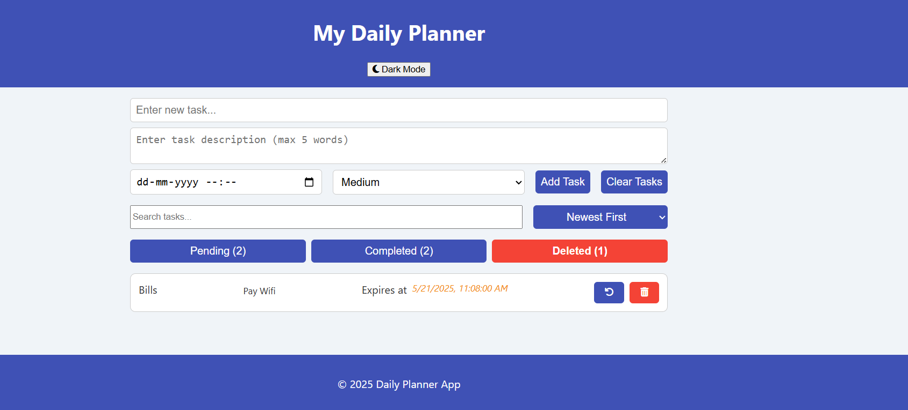

# 🗓️ Daily Planner App – Vanilla JS, HTML & CSS

## Overview

This is a feature-rich **Daily Planner Web Application** built using **vanilla JavaScript**, **HTML**, and **CSS**. It allows users to manage daily tasks with functionalities such as task status tracking, due date management, sorting, searching, dark mode toggle, and local storage persistence — all wrapped in a responsive and PWA-ready interface.

---

## 📌 Functionality

### 1️⃣ Task Management

- Add new tasks with:
  - **Title**
  - **Short description**
  - **Due date**
  - **Priority level**
- Mark tasks as **Completed**, **Deleted**, or keep them **Pending**
- Recover or permanently delete removed tasks

### 2️⃣ Smart Features

- **Live search bar** to quickly find tasks by title
- **Sorting** options:
  - Newest First
  - Due Date
  - Alphabetical (A → Z)
- **Tabs** to switch between `Pending`, `Completed`, and `Deleted` task views
- **Toasts** for undo actions and user feedback

### 3️⃣ Theming & UX

- Light/Dark mode toggle with persisted preference
- Smooth **UI transitions**
- Responsive for mobile, tablet, and desktop
- **Back to Top** button for long lists

### 4️⃣ Persistence & PWA

- All data is stored using **localStorage**
- Installable as a **Progressive Web App** with manifest support

---

## ⚙️ Tech Stack

- **HTML5**
- **CSS3** (custom styles + dark mode)
- **JavaScript (ES6+)**
- **Font Awesome** for icons
- **LocalStorage** for persistence
- **Web Manifest** for PWA support

---

## 🎯 Outcome

- A beautiful and user-friendly **Task Planner**.
- Smart filtering and sorting logic to prioritize daily activities.
- Toggle between **light and dark modes** with a single click.
- Persistent storage ensures tasks are not lost on refresh.
- **Installable app** for mobile-like experience.

---

## 🚀 Preview

<!-- <table>
  <tr>
    <td></td>
    <td></td>
  </tr>
</table>

---

## 📁 Folder Structure -->

